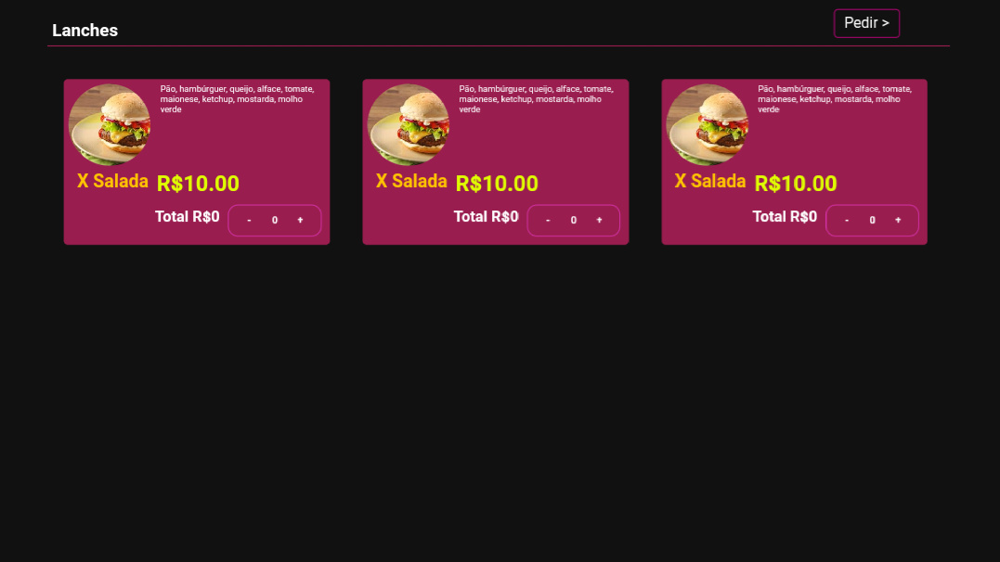

<h1>CardapioOn</h1>
Cardápio Online interativo

  

<h2>Adicionar Categorias</h2>
Para adicionar uma categoria você precisa ir em declara.js e executar à seguinte função:
 
<code>addCategoria(nome da categoria, identificação da categoria);</code>

<h2>Adicionar uma Opção em uma Categoria</h2>
Para adicionar uma opção de item em uma Categoria você precisa ir em declara.js e executar à seguinte função:
 
<code>addItem(nome da opção, valor da opção, ingredientes, imagem da opção, identificação da categoria);</code>

<h2>Adicionar imagens</h2>
Para adicionar imagens você precisa ter seu arquivo na pasta IMGS.

<h2>Adicionar o número de WhatsApp</h2>
Para adicionar o número de WhatsApp vá em declara.js e altere a seguinte variável com o seu número:
 
<code>let numero = false; // Troque false pelo seu número de celular